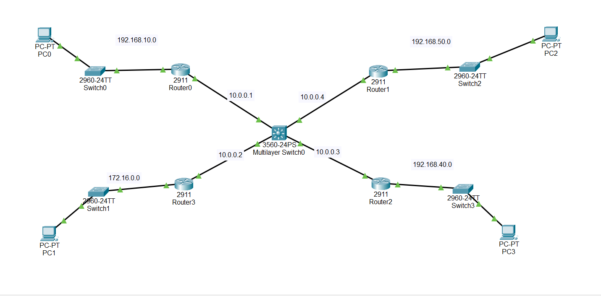

# Dynamic OSPF Routing Project

## 📌 Overview
This project demonstrates **Dynamic Routing using OSPF (Open Shortest Path First)** across 4 Cisco routers, connected in a star topology through a multilayer switch.  
The goal is to enable automatic route propagation without manually configuring static routes.

---

## 🖥 Topology
- 4 Routers (Cisco 2911)
- 4 PCs (End Devices)
- 4 Layer 2 Switches (Cisco 2960)
- 1 Multilayer Switch (Cisco 3560)

**Topology Diagram:**  


---

## 🌐 IP Addressing Table

| Device       | Interface       | IP Address       | Subnet Mask       |
|-------------|-----------------|-----------------|------------------|
| Router0     | G0/0            | 10.0.0.1        | 255.255.255.0    |
|             | G0/1            | 192.168.10.1    | 255.255.255.0    |
| Router1     | G0/0            | 10.0.0.4        | 255.255.255.0    |
|             | G0/1            | 192.168.50.1    | 255.255.255.0    |
| Router2     | G0/0            | 10.0.0.3        | 255.255.255.0    |
|             | G0/1            | 192.168.40.1    | 255.255.255.0    |
| Router3     | G0/0            | 10.0.0.2        | 255.255.255.0    |
|             | G0/1            | 172.16.0.1      | 255.255.0.0      |
| PC0         | NIC             | 192.168.10.10   | 255.255.255.0    |
| PC1         | NIC             | 172.16.0.10     | 255.255.0.0      |
| PC2         | NIC             | 192.168.50.10   | 255.255.255.0    |
| PC3         | NIC             | 192.168.40.10   | 255.255.255.0    |

---

## ⚙️ OSPF Configuration (Router Example)
```bash
Router(config)# router ospf 10
Router(config-router)# router-id 1.1.1.1
Router(config-router)# log-adjacency-changes
Router(config-router)# network 10.0.0.0 0.0.0.255 area 0
Router(config-router)# network 172.16.0.0 0.0.255.255 area 0
```

Repeat for each router with its own Router-ID and network statements.

---

## ✅ Verification
Check OSPF neighbors:
```bash
Router# show ip ospf neighbor
```

Check routing table:
```bash
Router# show ip route
```

Test connectivity:
```bash
PC> ping 192.168.50.10
PC> ping 192.168.40.10
PC> ping 172.16.0.10
```

All pings should succeed, confirming that **dynamic OSPF routing** is working.

---

## 📂 Project Structure
```
Dynamic-OSPF-Routing/
│── topology.png
│── README.md
│── PacketTracerFile.pkt
```

---

## 🏷 Suggested GitHub Repo
- **Name:** `Dynamic-OSPF-Routing`
- **Description:** Dynamic routing project using OSPF across 4 Cisco routers in Packet Tracer
- **Topics:** `cisco`, `ospf`, `dynamic-routing`, `networking`, `packet-tracer`

---
**Author:** Manar Hossam
